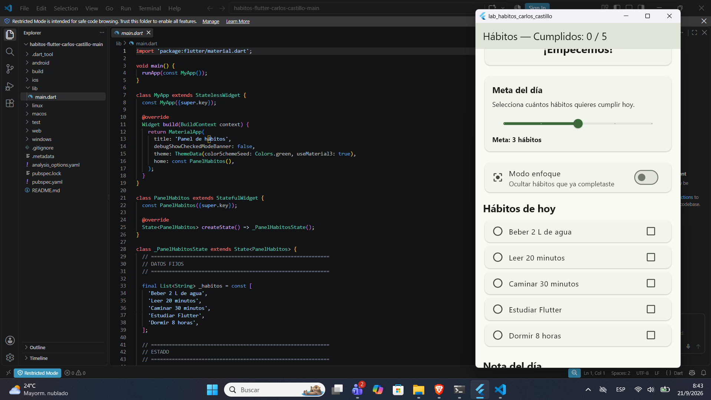
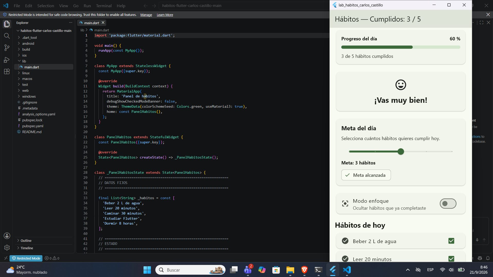
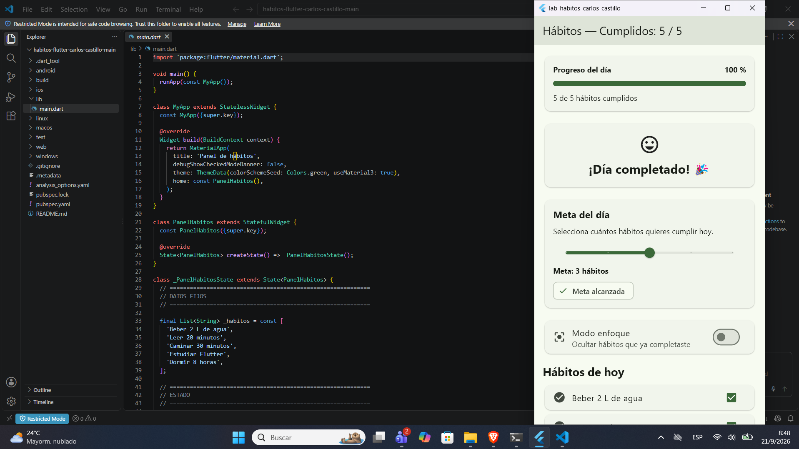
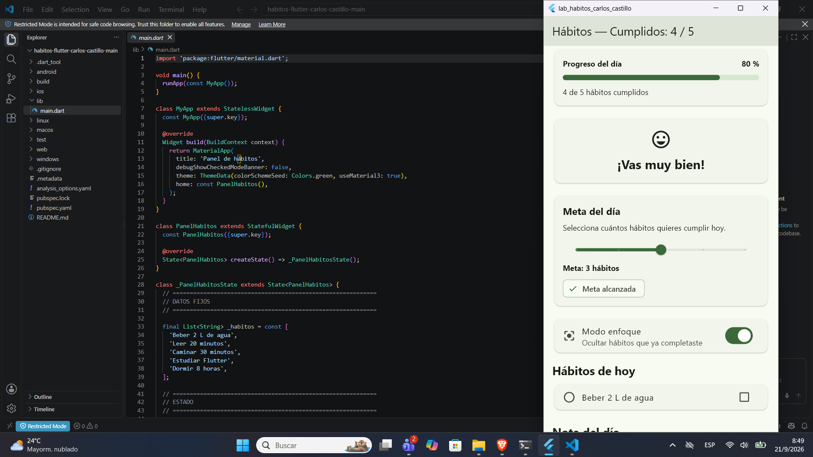
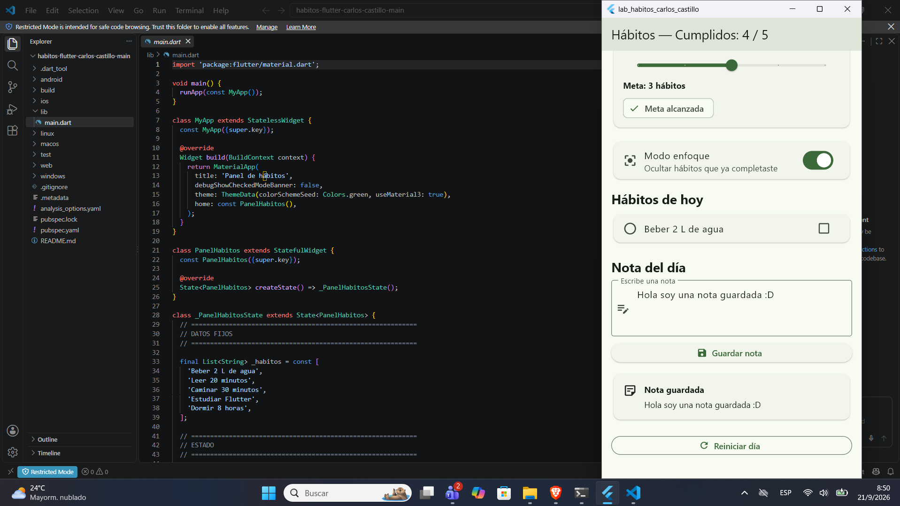
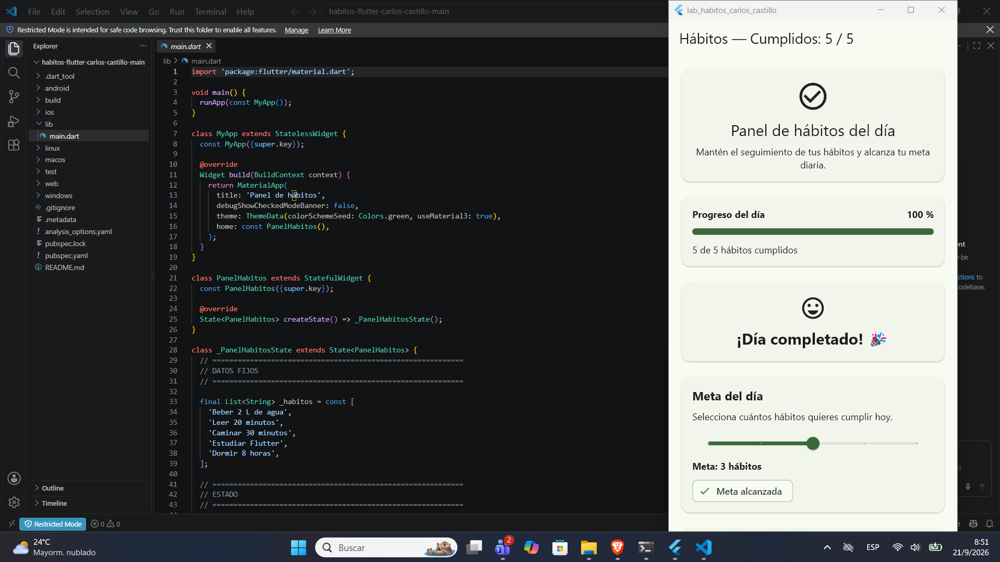

# 📱 Panel de Hábitos del Día

Aplicación desarrollada en **Flutter** como parte de la Semana 7 de práctica de desarrollo móvil. El proyecto consiste en un panel interactivo para registrar y visualizar el cumplimiento de hábitos diarios.

La aplicación utiliza un `StatefulWidget` y `setState()` para administrar diferentes variables de estado y actualizar la interfaz de forma dinámica. El usuario puede marcar hábitos como cumplidos, establecer una meta diaria, activar un modo de enfoque, escribir una nota y reiniciar todo el progreso del día.

## 🎯 Objetivo

Practicar la gestión de estado local en Flutter mediante `StatefulWidget` y `setState()`, coordinando diferentes elementos de la interfaz a partir de un mismo estado.

## 🛠️ Tecnologías utilizadas

* **Flutter 3.x**
* **Dart**
* **Material Design 3**
* `StatefulWidget`
* `setState()`
* `TextEditingController`
* `ListView`
* `CheckboxListTile`
* `SwitchListTile`
* `Slider`
* `LinearProgressIndicator`

No se utilizaron paquetes externos de gestión de estado como Provider, Riverpod, Bloc, Cubit, GetX o similares.

---

## 📋 Variables de estado

| Variable       | Tipo                    | Descripción                                                                        |
| -------------- | ----------------------- | ---------------------------------------------------------------------------------- |
| `_cumplidos`   | `List<bool>`            | Almacena si cada uno de los hábitos ha sido completado o no.                       |
| `_meta`        | `int`                   | Cantidad de hábitos que el usuario establece como meta diaria.                     |
| `_enfoque`     | `bool`                  | Determina si está activado el modo enfoque, que oculta los hábitos ya completados. |
| `_nota`        | `String`                | Contiene la nota guardada por el usuario para el día.                              |
| `_notaCtrl`    | `TextEditingController` | Permite controlar el contenido introducido en el campo de texto de la nota.        |
| `_metaInicial` | `int`                   | Define el valor inicial de la meta diaria, establecido en 3 hábitos.               |

### Variables derivadas

Además de las variables de estado, la aplicación utiliza getters para calcular información a partir del estado actual:

```dart
_totalCumplidos
```

Calcula la cantidad total de hábitos que han sido completados.

```dart
_progreso
```

Calcula el porcentaje de progreso del día utilizando la cantidad de hábitos cumplidos.

```dart
_metaAlcanzada
```

Determina si la cantidad de hábitos cumplidos ya alcanzó la meta establecida.

```dart
_mensaje
```

Genera un mensaje motivacional dependiendo del porcentaje de progreso:

* `0 %` → ¡Empecemos!
* `1–49 %` → Buen inicio
* `50–99 %` → ¡Vas muy bien!
* `100 %` → ¡Día completado! 🎉

---

## 🔄 Gestión del estado

Las modificaciones de estado se realizan mediante `setState()`.

### Marcar un hábito

Cuando el usuario marca o desmarca un hábito:

```dart
void _alternarHabito(int index) {
  setState(() {
    _cumplidos[index] = !_cumplidos[index];
  });
}
```

Esto provoca que Flutter reconstruya la interfaz y actualice automáticamente:

* El contador de hábitos cumplidos.
* La barra de progreso.
* El porcentaje.
* El mensaje motivacional.
* El estado de la meta.
* La lista de hábitos cuando está activo el modo enfoque.

### Cambiar la meta

```dart
void _cambiarMeta(double valor) {
  setState(() {
    _meta = valor.round();
  });
}
```

### Activar el modo enfoque

```dart
void _alternarEnfoque(bool valor) {
  setState(() {
    _enfoque = valor;
  });
}
```

### Guardar una nota

```dart
void _guardarNota() {
  setState(() {
    _nota = _notaCtrl.text.trim();
  });
}
```

### Reiniciar el día

El botón **Reiniciar día** restablece todas las variables a sus valores iniciales:

```dart
void _reiniciarDia() {
  setState(() {
    _cumplidos = List<bool>.filled(_habitos.length, false);
    _meta = _metaInicial;
    _enfoque = false;
    _nota = '';
    _notaCtrl.clear();
  });
}
```

---

# 📸 Capturas de pantalla

Las siguientes capturas muestran diferentes estados de la aplicación.

> Colocar las imágenes dentro de la carpeta `screenshots/`.

## P-1 — Estado inicial

La aplicación inicia con todos los hábitos pendientes, progreso en 0 %, meta establecida en 3 hábitos y modo enfoque desactivado.



---

## P-2 — Hábitos completados

Se muestran algunos hábitos marcados como completados y la actualización automática del contador, porcentaje de progreso y mensaje motivacional.



---

## P-6 — Meta alcanzada

La cantidad de hábitos completados alcanza la meta establecida por el usuario y aparece el indicador **"Meta alcanzada"**.



---

## P-10 — Modo enfoque

El modo enfoque se encuentra activado y los hábitos que ya fueron completados se ocultan de la lista.



---

## 📝 Captura adicional — Nota guardada

Se muestra una nota escrita por el usuario y almacenada en el estado de la aplicación.



---

## 🎉 Captura adicional — Día completado

Todos los hábitos han sido completados y la aplicación muestra un progreso del 100 % junto con el mensaje **"¡Día completado! 🎉"**.



---

# 💭 Reflexión sobre la gestión del estado

Uno de los errores que podría presentarse al desarrollar esta aplicación es modificar una variable de estado sin utilizar `setState()`. Por ejemplo, cambiar directamente `_cumplidos[index]` o `_meta` haría que el valor cambiara internamente, pero la interfaz podría no actualizarse inmediatamente. Para evitar este problema, todas las acciones que modifican el estado de la aplicación se realizan dentro de `setState()`, permitiendo que Flutter reconstruya los widgets que dependen de esos valores. También fue importante utilizar getters como `_totalCumplidos`, `_progreso` y `_metaAlcanzada`, ya que estos valores dependen del estado actual y se recalculan automáticamente cada vez que la interfaz se reconstruye. Finalmente, se implementó `dispose()` para liberar correctamente el `TextEditingController` cuando el widget deja de utilizarse.

---

## ▶️ Ejecución del proyecto

Desde la terminal, ejecutar:

```bash
flutter pub get
flutter run
```

Para verificar que el proyecto no presenta problemas de análisis:

```bash
flutter analyze
```

El resultado esperado es:

```text
No issues found!
```

---

## 📁 Estructura principal

```text
lab-habitos-flutter/
│
├── lib/
│   └── main.dart
│
├── screenshots/
│   ├── P-1.png
│   ├── P-2.png
│   ├── P-6.png
│   ├── P-10.png
│   ├── P_Adicional.png
│   └── P_Adicional1.png
│
├── .gitignore
├── pubspec.yaml
└── README.md
```
## 🎥 Video de demostración

En el siguiente video se presenta el funcionamiento de la aplicación **Panel de hábitos del día**, incluyendo la gestión de estado mediante `setState()`, actualización de la interfaz, modo enfoque, registro de notas, cumplimiento de hábitos y reinicio del día.

👉 [Ver video de demostración — Explicación ejercicio Flutter 29-2971-2023.mp4](https://mailutecedusv-my.sharepoint.com/:v:/g/personal/2929712023_mail_utec_edu_sv/IQCcdP2XpGnoSLkDr-NbYH5yAWO26Bc4gE6cYJOdII5wtqg?nav=eyJyZWZlcnJhbEluZm8iOnsicmVmZXJyYWxBcHAiOiJPbmVEcml2ZUZvckJ1c2luZXNzIiwicmVmZXJyYWxBcHBQbGF0Zm9ybSI6IldlYiIsInJlZmVycmFsTW9kZSI6InZpZXciLCJyZWZlcnJhbFZpZXciOiJNeUZpbGVzTGlua0NvcHkifX0&e=hlCKVq)

> El video contiene una demostración práctica y la explicación de los principales aspectos técnicos de la aplicación.

---

## 👨‍💻 Autor

**Daniel Sosa**

Proyecto académico desarrollado con Flutter para la práctica de gestión de estado local mediante `StatefulWidget` y `setState()`.
